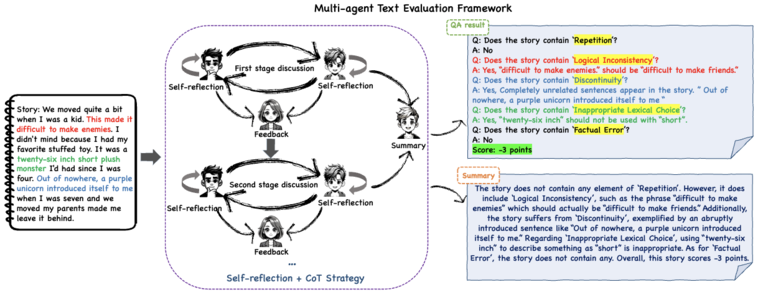








I am a Ph.D. student in Computer Science and Technology at Southeast University (Fall 2025), supervised by Prof. <a href='https://lfeng1995.github.io/'>Lei Feng </a>. Previously, I received my master’s degrees from Southeast University and Monash University (Double degree program), advised by Prof. <a href='https://cs.seu.edu.cn/gqi/main.htm'> Guilin Qi </a>. I received my Bachelor’s degree in Computer Science and Technology from Hefei University of Technology in June 2021.

My research interest includes:

- Fine‑tuning and Reinforcement Learning for LLMs
- LLM‑Driven Autonomous Agent Architectures
- Cooperative Multi‑Agent Collaboration
- Security and Robustness in LLMs &amp; Agent Frameworks

# 🔥 News
- *2025.01*: &nbsp;🎉 Our paper (<a href='https://arxiv.org/abs/2501.15791'> MAKGED </a>) was accepted by DASFAA 2025, Oral Paper!
- *2024.12*: &nbsp;🎉 Our paper was accepted by AAAI 2025!
- *2024.03*: &nbsp;🎉 Our paper (<a href='https://link.springer.com/chapter/10.1007/978-981-97-5575-2_31'> MATEval </a>) was accepted by DASFAA 2024, Oral Paper!
- *2024.03*: &nbsp;🎉 Our paper (<a href='https://link.springer.com/chapter/10.1007/978-981-97-5575-2_29'> DEE </a>) was accepted by DASFAA 2024, Oral Paper!
- *2024.01*: &nbsp;🎉 Our paper was accepted by NAACL 2024!

# 📝 Publications 

DASFAA 2024

[MATEval: A Multi-Agent Discussion Framework
for Advancing Open-Ended Text Evaluation](https://arxiv.org/pdf/2403.19305?) （DASFAA 2024 Oral）

**Yu Li***, Shenyu Zhang*, Rui Wu, Xiutian Huang, Wenhao Xu, Guilin Qi, Dehai Min

[**Code**](https://github.com/ElevenLiy/MATEval) <strong></strong> 

- [Harnessing Diverse Perspectives: A Multi-Agent Framework for Enhanced Error Detection in Knowledge Graphs](https://arxiv.org/abs/2501.15791) （DASFAA 2025 Oral）  
  **Yu Li**, Yi Huang, Guilin Qi, Junlan Feng, Nan Hu, Songlin Zhai, Haohan Xue, Yongrui Chen, Ruoyan Shen, Tongtong Wu  
  [**Code**](https://github.com/ElevenLiy/MAKGED) <strong></strong> 

- [DEE: Dual-Stage Explainable Evaluation Method for Text Generation](https://link.springer.com/chapter/10.1007/978-981-97-5575-2_29) （DASFAA 2024 Oral）  
  Shenyu Zhang*, **Yu Li***, Rui Wu, Xiutian Huang, Yongrui Chen, Wenhao Xu, Guilin Qi

- [Hegta: Leveraging heterogeneous graph-enhanced large language models for few-shot complex table understanding](https://ojs.aaai.org/index.php/AAAI/article/view/34606) （AAAI 2025）  
  Rihui Jin, **Yu Li**, Guilin Qi, Nan Hu, Yuan-Fang Li, Jiaoyan Chen, Jianan Wang, Yongrui Chen, Dehai Min, Sheng Bi  

- [Can ChatGPT replace traditional KBQA models? An in-depth analysis of the question answering performance of the GPT LLM family](https://link.springer.com/chapter/10.1007/978-3-031-47240-4_19) （ISWC 2023, Oral）  
  Yiming Tan, Dehai Min, **Yu Li**, Wenbo Li, Nan Hu, Yongrui Chen, Guilin Qi  
  [**Code**](https://github.com/tan92hl/Complex-Question-Answering-Evaluation-of-GPT-family)

- [Exploring the impact of table-to-text methods on augmenting llm-based question answering with domain hybrid data](https://arxiv.org/abs/2402.12869) （NAACL 2024, Oral）  
  Dehai Min, Nan Hu, Rihui Jin, Nuo Lin, Jiaoyan Chen, Yongrui Chen, **Yu Li**, Guilin Qi, Yun Li, Nijun Li, Qianren Wang  

# 🎖 Honors and Awards
- *2025.06*:  Outstanding Graduate, Southeast University 
- *2024.10*:  First‑Class Scholarship, Southeast University

# 📖 Educations
- *2025.09 – Present*:  Ph.D. in Computer Science and Engineering, Southeast University. 
- *2022.09 - 2025.06*:  M.S. in Computer Science and Engineering (Double Degree), Southeast University & Monash University.
- *2017.09 - 2021.06*:  B.S. in Computer Science and Technology, Hefei University of Technology .

# 💻 Internships
- *2023.09 - 2024.03*:  Ant Group, Hangzhou, China.
